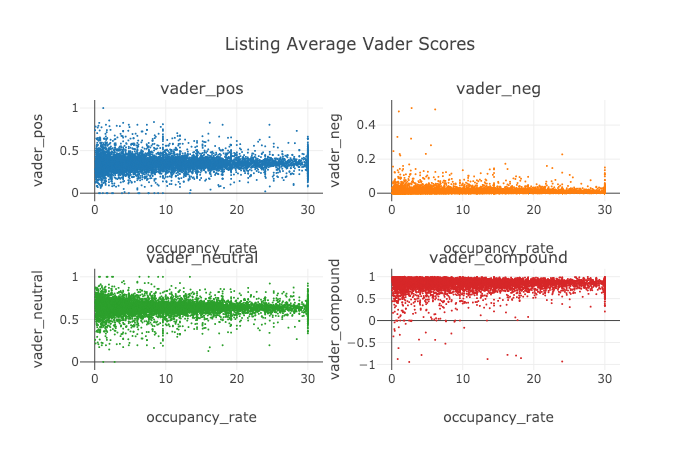
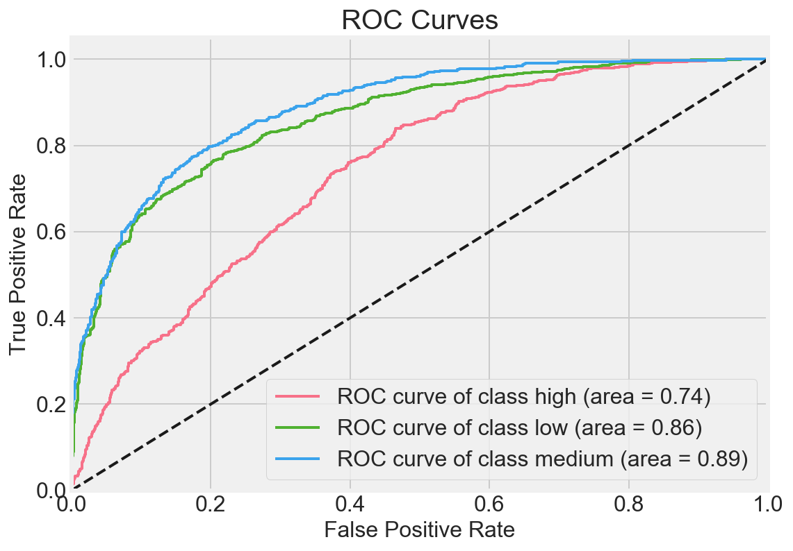

#  AirBnb Analysis
## Capstone Project for DSI7 at General Assembly


The aim was to build a predictive model that would predict the occupancy of an AirBnb listing based on the information in the listing and reviews of each listing. Currently the analysis and models are for the Berlin, Germany only, but I aim to expand the scope in the future.

**Part 1** is The initial Ideas stage. The requirements were to identify two projects that we would like to investigate and what we might aim to predict. Two options were presented; Predicting earthquake damage, or the adopted idea, Predicting Airbnb occupancy rates in Berlin.

**Part 2** is an initial analysis and cleaning of the csv files.

**Part 3** is the first checkpoint with EDA and the first model fitting. Sentiment analysis was performed on the reviews.



**Part 4** is the conclusion of our project with the process from start to finish outlining all the steps taken, and the presentation and analysis of the predictive model /models Notebook. A GradientBoosting algorithm was able to predict the occupancy rate to 69% (baseline of 25%).



**Part 5** Is the final Presentation given to the cohort Final Keynote Presentation.

## Scope
The Final Project on the Data Science & Machine Learning Immersive Course at General Assembly London. The project aim was set by me, and all data was downloaded in .csv format from insideairbnb.com in December 2018

## Contents
The majority of the deliverables that were created for each checkpoint of the project.

To run, work through each notebook from part 2 through to part 4 in order. Please be aware that parts 3 and 4 have multiple notebooks. this may take some time to run. The data files are included in a zip file and will be extracted automatically.

##### Required dependancies

```
pandas
scipy
numpy
matplotlib
scikitplot
seaborn
cufflinks
plotly
nltk.corpus
sklearn
langdetect
vader
textacy
SpaCy
```
